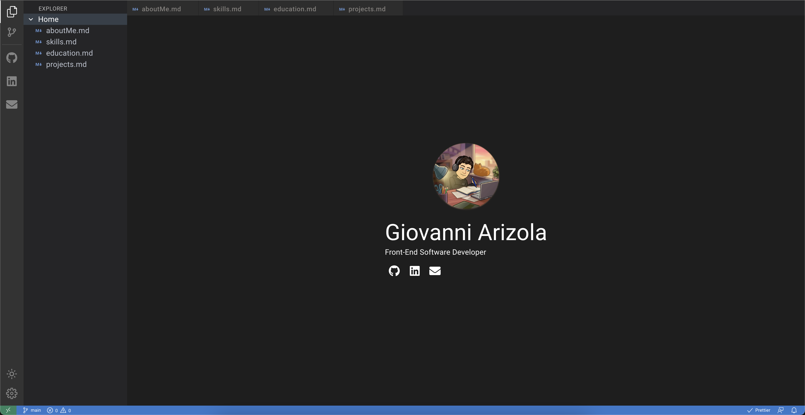

# 🧪 Projects

## **-- React.js/Next.js Projects --**

## [Portfolio (this)](https://giovanniarizola.xyz/) 🔗

### 

- What you are currently looking at
- Visual Studio Code inspired :)
- Responsive Web Design, explorer/page icon in the top left functions as a menu
- React.js (TypeScript), MUI
- [Github Repo](https://github.com/garizola/portfolio)

#

## [Omega Fitness](https://omegafitness.netlify.app/) 🔗

### 

- This app lets users search a body part, exercise, or target muscle to find similar exercises
- After clicking any exercises, recommended youtube tutorials will show for that exercise
- React.js, MUI, API utilization
- [Github Repo](https://github.com/garizola/omega-fitness-react#react-fitness-app)

#

## [History of Moby](https://mobyhistory.netlify.app/) 🔗

### 

- One page application acting as a small rundown of the musical artist Moby
- Animation with Framer Motion, Responsive, simple/modern design
- React.js, Tailwind, Framer Motion
- [Github Repo](https://github.com/garizola/n320project2)

#

## [Ecommerce Site](https://humanknots.vercel.app/) 🔗

### 

- Site created for a jiu-jitsu inspired clothing brand named Human Knots
- Next.js, Sanity.io (headless CMS), Stripe payment processing
- Has not fully launched yet due to client's wishes
- [Github Repo](https://github.com/garizola/nextjs-ecommerce-humanknots)

#

## [Personal Todos Site](https://gios-todos.netlify.app/) 🔗

### 

- An application that just lets me add, mark-off, and delete todos
- Priority, and separate completed column coming soon
- React.js, Tailwind, Firestore
- [Github Repo](https://github.com/garizola/omega-fitness-react#react-fitness-app)

#

## [Universal Contact Form](https://contact-giovanni.vercel.app/) 🔗

### 

- Universal contact form that can be linked in any application.
- Using Nodemailer and my Gmail account, sends an email to myself with the required inputs
- Form validation included
- Next.js, Chakra, Nodemailer
- [Github Repo](https://github.com/garizola/universal-contact-form)

##

## **-- PHP Projects --**

## [Artist Archive](https://in-info-web4.informatics.iupui.edu/~garizola/litjams/) 🔗

### 

- Universal contact form that can be linked in any application.
- Using Nodemailer and my Gmail account, sends an email to myself with the required inputs
- Form validation included
- Next.js, Chakra, Nodemailer
- [Github Repo](https://github.com/garizola/universal-contact-form)

#

## **-- jQuery/Design Projects --**

## [Magnitude Fitness](https://in-info-web4.informatics.iupui.edu/~garizola/portfolioN299/) 🔗

### 

- PHP, CodeIgniter Framework, Bootstrap, MySQL
- Register, login (with admin feature), contact form
- [Github Repo](https://github.com/garizola/litjams)

#

## [BookNook](https://in-info-web4.informatics.iupui.edu/~garizola/booknook/#home) 🔗

### 

- This was a collaborative project assigned in a web development class
- Users can add to cart and read different blog post
- Replicated from a given Adobe XD file
- HTML, SASS, jQuery
- [Github Repo](https://github.com/N315-kbriske/homework-five-backup)

##

## Check out more of my projects on my [Github](https://github.com/garizola)!

#
